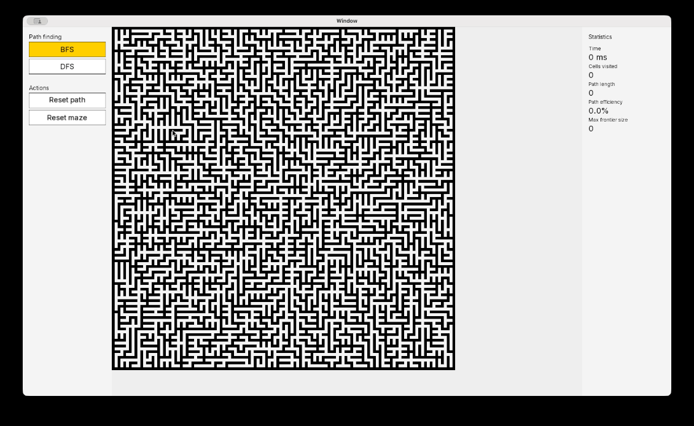

# Mazemetrics

A C++ maze generation and pathfinding visualizer built with SFML. It generates a maze, lets you pick start and end points, then runs a pathfinding algorithm step by step so you can watch it explore the grid and compare it against other algorithms on the exact same maze.



## What it does

- Generates a maze using randomized Prim's algorithm.
- Lets you click to set a start and end point anywhere on the generated maze.
- Runs BFS or DFS to find a path between them, animated in real time.
- Tracks and displays statistics for each run: time taken, cells visited, path length, path efficiency, and maximum frontier size.
- Lets you reset just the pathfinding result (to try a different algorithm on the same maze, keeping your start and end points) or reset the whole maze and generate a new one.

## Why

Most maze visualizers show you that an algorithm works. This one is built to make it easy to compare how different algorithms behave under the same conditions. Because the maze, start point, and end point can all stay fixed while you switch algorithms, the statistics panel actually means something: you can run BFS, reset just the path, run DFS, and directly compare how many cells each one visited and how efficient the resulting path was.

## Statistics tracked

- **Time**: milliseconds elapsed during the search.
- **Cells visited**: number of unique cells the algorithm explored.
- **Path length**: number of cells in the final path from start to end.
- **Path efficiency**: what percentage of visited cells ended up on the final path. A higher number means the algorithm wasted less effort exploring dead ends.
- **Max frontier size**: the largest the algorithm's queue (BFS) or stack (DFS) ever grew during the search. This is a rough number for peak memory usage.

Running BFS and DFS on the same maze usually makes the tradeoff visible: BFS tends to have much higher path efficiency since it explores outward evenly and finds the shortest path, while its frontier grows large. DFS is the opposite: it commits to one direction at a time, so its frontier stays smaller, but it explores less efficiently and does not guarantee the shortest path.

## Controls

- **Left click**: set start point, then end point.
- **Right click**: remove a start or end point.
- **Space**: begin pathfinding once both start and end are set.
- **R**: reset the whole maze and generate a new one.
- Sidebar buttons let you switch between BFS and DFS, reset just the path, or reset the whole maze.

## Architecture

The project is split into a few independent pieces that only talk to each other through small interfaces:

- **Grid** owns the maze's cell state and rendering data. It is the only place that knows about pixel positions and SFML vertex arrays.
- **MazeGenerator** is an abstract base class. `PrimGenerator` is the only implementation right now, but new generation algorithms can be added by extending the base class without touching anything else.
- **PathFinder** is the same idea for pathfinding. `BFS` and `DFS` both extend it, and neither one knows anything about pixels or rendering; they only work with `Position` and `Type`.
- **MazeSimulator** owns the overall state machine (generating, finding a path, reconstructing it) and coordinates between the grid, the active generator, and the active pathfinder. Algorithms are stored in a name-to-constructor map, so switching algorithms at runtime is just swapping which one gets constructed.
- **Renderer**, **Sidebar**, **Button**, and **StatsPanel** handle drawing and UI. None of them know anything about how a maze is generated or solved; they just draw whatever state they're given and report clicks back through callbacks.

Because the algorithms never touch pixels and the UI never touches algorithm internals, adding a new pathfinding algorithm or a new UI element does not require changes anywhere else in the codebase.

## Building

This project uses CMake and depends on SFML 3.

```bash
cmake -S . -B build
cmake --build build
```

The executable is placed at `build/bin/maze`.

A font file is required for the UI text to render. There's already a default font file but if you'd like to change the font, place any `.ttf` file at `asset/fonts/font.ttf` in the project root before running.

## Running

```bash
./build/bin/maze
```

## TODO

- Only one maze generation algorithm (Prim's) is currently implemented, though the architecture supports adding more.
- Only BFS and DFS are implemented. An informed search algorithm like A\* would be a natural next addition.
- Currently there's no way to control the speed of the maze generation or path finding, so adding that functionaility would be great for algorithm analysis.
